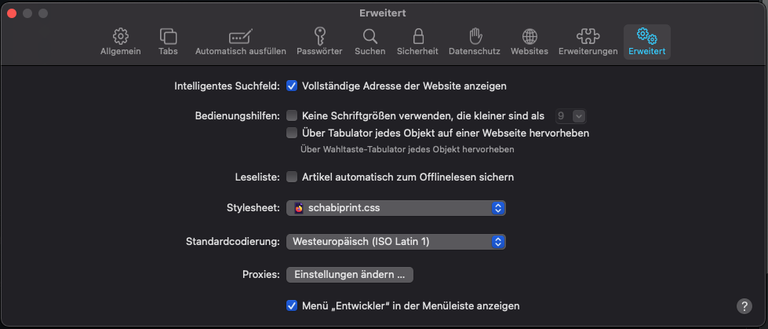

# schabi-css
Printer friendly css for schabi.ch

Hides unnecessary columns and headers and improves print output of schabi.ch

## Install
1. Download the schabiprint.css file and safe it to your user folder
2. Choose the stylesheet in Safari with: Safari - Properties - Advanced - Style sheet
   
